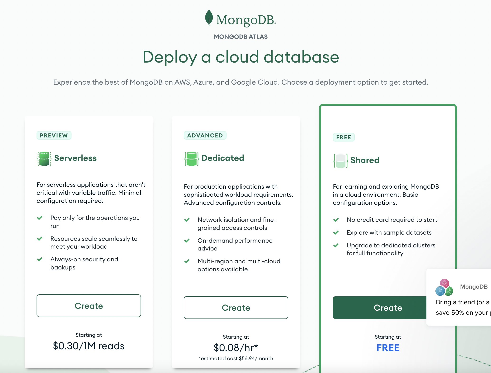
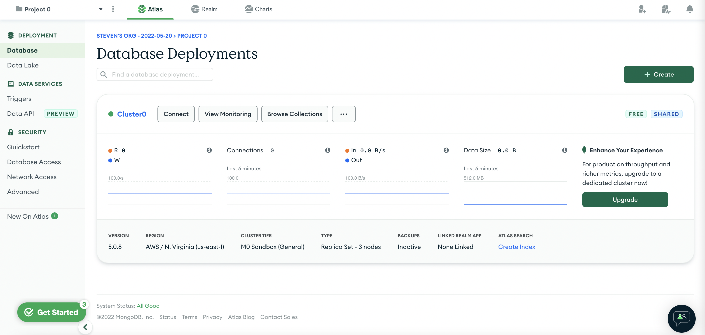
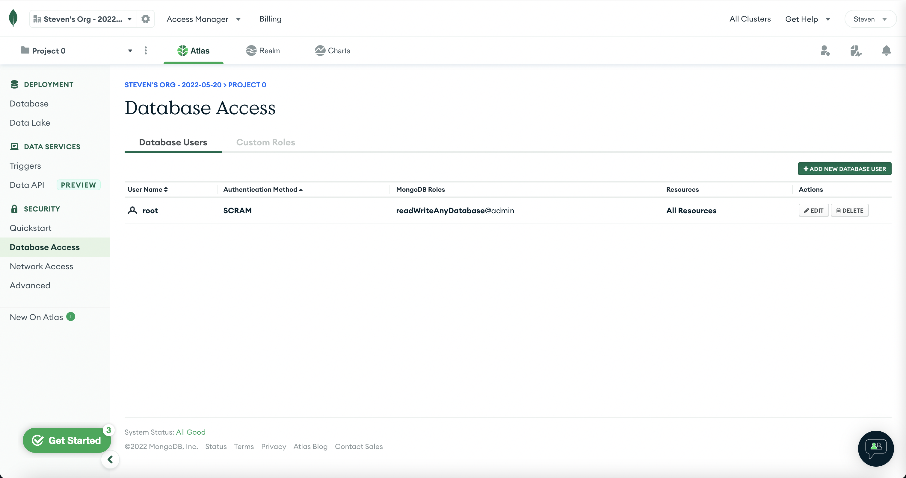
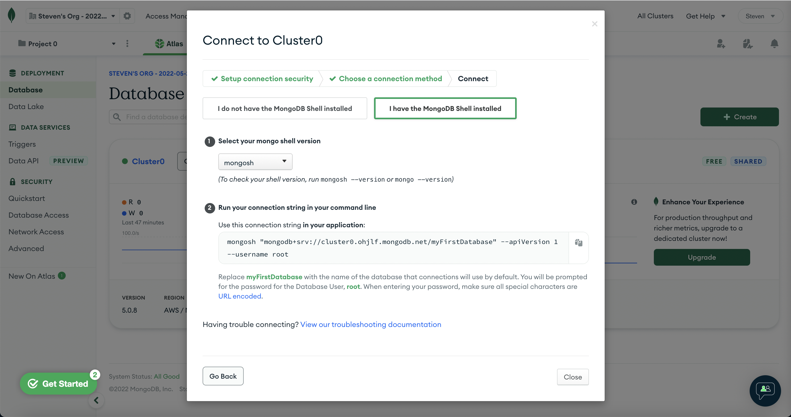

# NoSQL

[Official Doc (MongoDB)](https://www.mongodb.com/)

## Table of Content
### 1. [Intro](#intro)
### 2. [CAP](#cap)
### 3. [Set up](#set-up)
### 4. [Vocab](#vocab)
* [Collection](#collection)
* [Document](#document)
* [Field](#field)
### 5. [Syntax](#syntax)


## Intro
NoSQL databases are commonly used for specific data models and have flexible schemas for building modern applications. It is widely recognized for its ease of development, functionality, and performance at scale. It is optimized specifically for applications that require large data volume, low latency, and flexible data models, which are achieved by relaxing some of the data consistency restrictions of other databases.

Among all the NoSQL databases, mongoDB is the most famous and widely used ones, so in this education program we will cover the usage of mongoDB. MongoDB is a Document Database that stores the data in JSON (key-value) format 


## CAP
In the previous workshop we said the NoSQL database has CAP properties, and now we are going to explain what each of them means:

***Consistency***

Consistency means that all clients see the same data at the same time, no matter which node they connect to. For this to happen, whenever data is written to one node, it must be instantly forwarded or replicated to all the other nodes in the system before the write is deemed ‘successful.’

***Availability***

Availability means that that any client making a request for data gets a response, even if one or more nodes are down. Another way to state this—all working nodes in the distributed system return a valid response for any request, without exception.

***Partition tolerance***

A partition is a communications break within a distributed system—a lost or temporarily delayed connection between two nodes. Partition tolerance means that the cluster must continue to work despite any number of communication breakdowns between nodes in the system.

In addition to that, noSQL has the characteristics of being ***Scalable*** which means you can scale the database horizontally which is much better and less expensive than scale it vertcally, and it is also ***Schemaless*** which means the data stored has no specific structure which enables flexibility. However the downside of NoSQL is its inefficient query time compare to SQL database

## Set up

To set up, you could install mongoDB locally [here](https://www.mongodb.com/try/download/community) which require you to host mongoDB server on your local machine.

However in this educational program we will be using mongoDB Atlas which is the cloud-hosted MongoDB service on AWS, Azure and Google Cloud. First you need to sign up [here](https://www.mongodb.com/cloud/atlas/lp/try2?utm_source=google&utm_campaign=gs_americas_united_states_search_core_brand_atlas_desktop&utm_term=mongodb%20atlas&utm_medium=cpc_paid_search&utm_ad=e&utm_ad_campaign_id=12212624338&adgroup=115749704063&gclid=Cj0KCQjw-JyUBhCuARIsANUqQ_ImIQY_Mb_pGFM9p8nyOZ33mqomnm2WbYeyIoOUQD8FvPq_mTNa9YwaAijDEALw_wcB) and then after a short survey you should choose the free tier option (shared)



And then make no change to the default setting and then click ***Create CLuster***. The creation process should take servel minutes then you should see something like this



After that, you need to create a user that is able to access to this database, to do that, click ***Database access*** and then create a new user and choose ***Password*** as authentication method. Remember under ***Built-in Role*** in ***Database User Privileges***, choose ***Read and Write to any database***. After that you should see something like this



Then go to ***Network access*** and add an IP address to the access list. To do that, just click the ***Add current IP address*** button and it will auto fill it for you.

Now the environment is set up. It's time to install the mongodb shell using the link [here](https://www.mongodb.com/docs/mongodb-shell/install/#std-label-mdb-shell-install). To check if it is successfully installed, type
```
mongosh --version
```
It should return the correct version of mongosh

Next, in the ***database*** panel, click ***Connect*** button and then click ***Connect with the MongoDB Shell***. It should looks like this

Remember to copy the command stated in step 2 and then paste it in the terminal, it should be like the following


## Vocab

### Collection
A grouping of MongoDB documents. A collection is the equivalent of an RDBMS table. A collection exists within a single database. Collections do not enforce a schema. Documents within a collection can have different fields. Typically, all documents in a collection have a similar or related purpose. See Namespaces.

In shorts, Collection in noSQL is like Table in SQL

### Document
A record in a MongoDB collection and the basic unit of data in MongoDB. Documents are analogous to JSON objects but exist in the database in a more type-rich format known as BSON. See Documents.

In shorts, Document in noSQL is like Row in SQL

### Field
A name-value pair in a document. A document has zero or more fields. Fields are analogous to columns in relational databases. See Document Structure.

In shorts, Document in noSQL is like Column in SQL

## Syntax

First of all, to check your database, you can type
```
db
```
It will show
```
myFirstDatabase
```
To see all available databases, type
```
show dbs
```
This returns
```
admin  368.00 KiB
local   11.58 GiB
```
Notice that we cannot see ```myFirstDatabase``` because this database is still empty now
